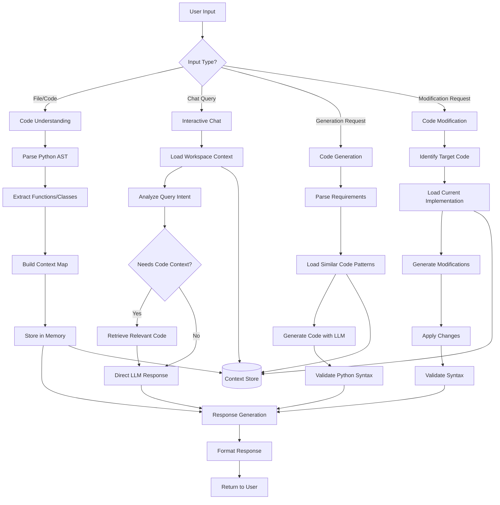

# BroCode Workflows

## Amazon Q-Inspired Code Assistant Workflow

This workflow implements core code assistant features (1-4) for Python development in BroCode.

## Core Features

### 1. Code Understanding & Context
- **Python AST Parser**: Analyzes code structure
- **Function/Class Extractor**: Identifies code components
- **Context Storage**: Maintains workspace awareness
- **Dependency Mapping**: Tracks imports and relationships

### 2. Real-time Code Assistance
- **Code Completion API**: Suggests completions as user types
- **Pattern Matching**: Identifies similar code patterns
- **Syntax Validation**: Ensures Python syntax correctness
- **Context-Aware Suggestions**: Uses workspace context for relevance

### 3. Interactive Chat & Problem Solving
- **Context-Aware Queries**: Loads relevant workspace context
- **Intent Analysis**: Determines what user wants to accomplish
- **Code Explanation**: Breaks down complex code sections
- **Debugging Assistant**: Helps identify and fix issues

### 4. Code Generation & Modification
- **Requirement Parsing**: Understands natural language requests
- **Template-Based Generation**: Uses patterns from existing code
- **Code Transformation**: Modifies existing implementations
- **Syntax Checking**: Validates generated/modified code

## Integration Points

This workflow integrates with BroCode's existing architecture:

- **LLM Models**: Registered models handle AI reasoning
- **CLI Interface**: Commands trigger appropriate workflow paths
- **Configuration**: Uses `.brocode_config.yaml` for settings
- **Context Store**: In-memory storage for workspace awareness

## Implementation Components

### Required Modules
- `ast` - Python AST parsing
- `pathlib` - File system operations
- `typing` - Type hints and validation
- `dataclasses` - Context storage structures

### Key Classes
- `CodeParser` - AST analysis and extraction
- `ContextManager` - Workspace context storage
- `CodeGenerator` - LLM-based code generation
- `SyntaxValidator` - Python syntax checking